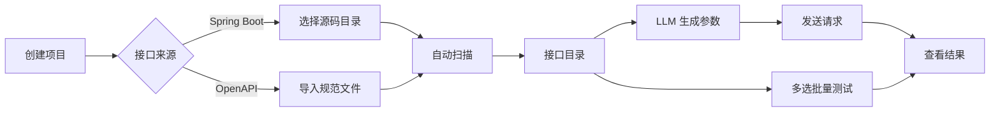

# ReqSmith

> **Scan. Shape. Test.** — 本地优先的 API 测试工作台

ReqSmith 是一个面向后端开发者和测试人员的桌面工具。它从 Java Spring Boot 源码或 OpenAPI 文档中自动发现接口，建立统一的接口目录，智能生成请求数据，并支持单接口调试和批量自动化测试。

---

## 核心特性

### 🔍 源码扫描
- 扫描 Java Spring Boot 项目，自动提取 Controller、方法、参数和注解信息
- 导入 OpenAPI 3.x JSON/YAML 规范文件
- 接口按项目 → 模块 → Controller 分组，支持中文命名与分类

### 🧠 LLM 智能参数生成
- 接入大语言模型（DeepSeek / OpenAI 兼容接口），根据字段语义和业务上下文自动生成测试参数
- 支持从本地配置文件自动加载 LLM 服务地址和模型信息
- 生成的参数附带置信度和来源说明，可手动修改

### ✅ 一键批量测试
- 多选接口 → 一键执行，顺序发送请求并汇总通过/失败结果
- 每次测试自动记录状态、响应时间和错误信息
- 支持环境变量、Bearer Token、Cookie 登录和请求覆盖

### 📂 按代码改动排序
- 扫描时记录每个源文件的最后修改时间
- 接口列表可按源文件修改时间降序排列，快速定位最近改动的接口

### 🔐 本地优先
- 源码、环境变量、令牌和测试结果全部保存在本地 SQLite
- 不上传任何数据到云端，API Key 等敏感信息不入版本库

---

## 技术栈

| 层 | 技术 |
|---|---|
| 桌面框架 | Electron 35 |
| 渲染层 | React + TypeScript + Vite |
| 状态管理 | Zustand |
| 数据库 | SQLite (Kysely + better-sqlite3) |
| 构建 | pnpm workspaces + Turborepo |
| 包管理 | pnpm 10 |

---

## 项目结构

```
ReqSmith/
├── apps/desktop/          # Electron 桌面应用
│   ├── src/main/          #   主进程（IPC、扫描调度、LLM 调用）
│   ├── src/preload/       #   预加载脚本（IPC 桥接）
│   └── src/renderer/      #   渲染进程（React UI）
├── packages/
│   ├── contracts/         # 共享类型定义（接口模型、IPC 契约）
│   ├── persistence/       # 数据库层（Kysely 迁移 + Repository）
│   ├── scanner-spring/    # Spring Boot 源码扫描器
│   ├── scanner-openapi/   # OpenAPI 3.x 导入器
│   ├── scanner-sdk/       # SDK 扫描器
│   ├── data-generator/    # 请求数据生成器（含 LLM 生成）
│   ├── design-system/     # 设计系统（CSS 变量、主题）
│   └── domain/            # 领域逻辑
└── REQSMITH-DESIGN.md     # 完整设计文档
```

---

## 快速开始

### 前置条件

- Node.js ≥ 20
- pnpm ≥ 10

### 安装与运行

```bash
# 克隆仓库
git clone https://github.com/saberKKSK/ReqSmith.git
cd ReqSmith

# 安装依赖
pnpm install

# 开发模式
pnpm dev

# 构建
pnpm build
```

### LLM 配置（可选）

LLM 参数生成功能需要配置 OpenAI 兼容的 API 服务。应用启动时会自动搜索以下路径的配置文件：

- `~/Downloads/opencode转发配置.json`
- `~/Documents/opencode转发配置.json`

也可以通过界面手动设置 API 地址和模型。

---

## 工作流程



---

## 许可证

Private — 仅供内部使用
