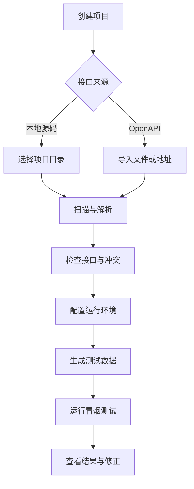
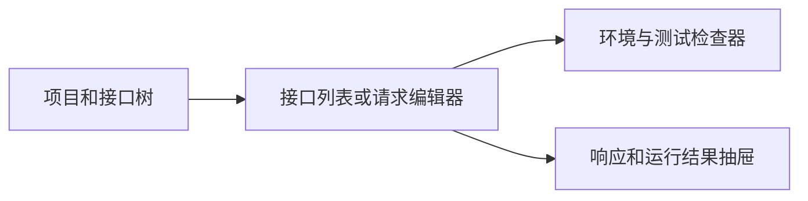
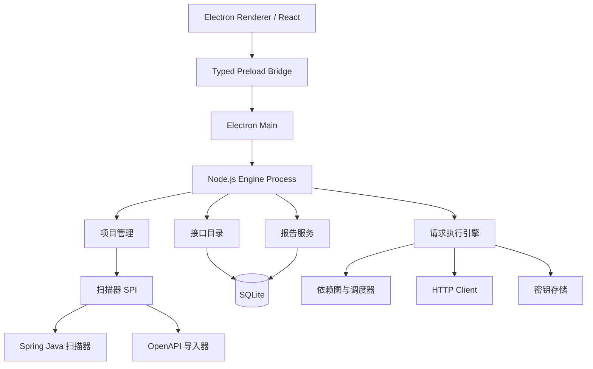
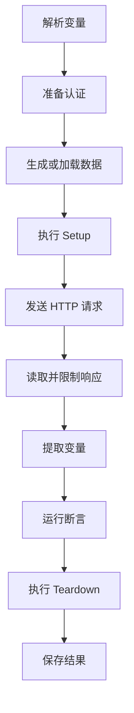
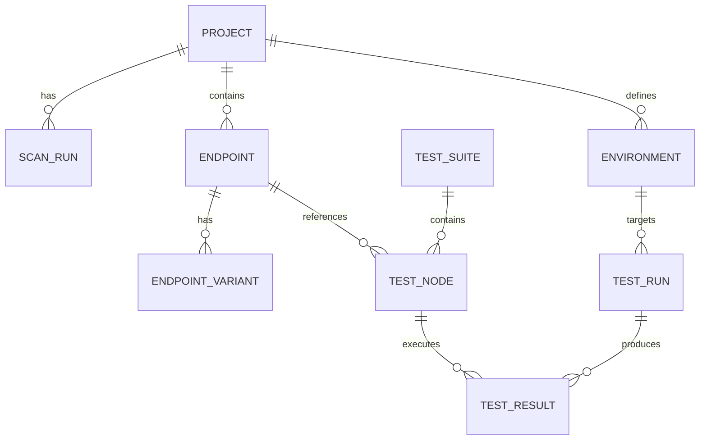

# ReqSmith 开发设计文档

> 文档状态：Draft v1.0  
> 目标版本：MVP  
> 产品名称：ReqSmith  
> 产品标语：Scan. Shape. Test.  
> 产品形态：本地优先的 Electron 桌面应用  
> 首期技术栈：Electron、Node.js、React、TypeScript、SQLite  
> 首期扫描范围：Java Spring Boot、OpenAPI 3.x

---

## 1. 文档目的

本文档定义一个面向后端开发者、测试人员和技术团队的接口扫描与自动化测试工具。工具从后端源码或 OpenAPI 文档中发现接口，建立统一的接口目录，自动生成请求数据，并支持单接口测试、手动编排、依赖驱动的批量测试、并行执行与结果报告。

本文档同时作为以下工作的共同依据：

- 产品需求评审
- UI/UX 设计
- 前后端开发
- 数据库设计
- 测试与验收
- 后续代码 Agent 的任务拆分与实现

---

## 2. 产品定义

### 2.1 一句话定义

一个能够理解后端源码、自动发现接口、自动准备测试数据并批量验证整个后端服务的本地 API 测试工作台。

### 2.2 核心价值

传统 API 工具依赖用户手工维护接口、填写参数和组织测试流程。本产品将接口定义、源码信息、数据约束和测试执行连接起来，让用户从“手工配置每个请求”转向“检查并运行自动生成的测试计划”。

### 2.3 产品原则

1. **源码优先**：接口目录可以直接从项目源码生成，不要求项目已经完善 Swagger。
2. **规范统一**：源码扫描、OpenAPI 导入和手工创建最终进入同一套接口模型。
3. **默认可运行**：扫描结束后应尽可能生成可以直接发送的请求，而不只是展示接口清单。
4. **自动但可解释**：所有自动生成的字段、依赖和断言都显示来源和置信度，允许用户修改。
5. **本地优先**：源码、环境变量、令牌和响应默认保存在本机，不上传到云端。
6. **执行可控**：批量测试必须支持限流、取消、重试、超时、失败策略和环境保护。
7. **结果可追踪**：任何失败都能定位到请求、响应、断言、数据来源和源码位置。

---

## 3. 目标与非目标

### 3.1 MVP 目标

- 扫描 Java Spring Boot 项目中的 HTTP 接口。
- 导入 OpenAPI 3.x JSON/YAML。
- 按项目、模块、Controller、标签和路径展示接口。
- 根据 DTO、类型、注解和字段语义自动生成请求数据。
- 支持环境变量、Bearer Token、Cookie 和登录取 Token。
- 支持单接口发送与响应查看。
- 支持手动选择接口进行顺序或并行测试。
- 支持接口之间提取变量和传递变量。
- 支持基于依赖图的批量执行。
- 支持基础断言、Schema 校验和测试报告。
- 支持运行历史、失败筛选和结果重跑。

### 3.2 MVP 非目标

- 不实现完整的性能压测平台。
- 不替代专业安全扫描器。
- 不执行任意项目业务代码来推导接口。
- 不承诺自动生成的数据一定满足复杂业务规则。
- 不在首期支持所有后端语言和框架。
- 不在首期实现在线多人实时协作。
- 不在首期实现云端同步和团队权限系统。

### 3.3 后续方向

- 支持 FastAPI、NestJS、Express、Gin、ASP.NET Core。
- 支持 GraphQL、WebSocket、SSE 和 gRPC。
- 支持契约回归、响应快照和版本差异分析。
- 支持 CI/CD 无界面执行器。
- 支持脱敏后的团队共享。
- 支持 AI 辅助生成业务场景和失败解释。

---

## 4. 用户角色

### 4.1 后端开发者

主要诉求：

- 快速确认新增接口是否可用。
- 自动获得请求示例。
- 在修改代码后批量执行相关接口。
- 从失败结果跳转到 Controller 或 DTO 源码。

### 4.2 测试人员

主要诉求：

- 浏览完整接口清单。
- 管理不同环境和测试账户。
- 组合接口场景并建立断言。
- 批量执行并导出报告。

### 4.3 技术负责人

主要诉求：

- 掌握接口覆盖率与健康度。
- 发现未测试、无文档或存在变更的接口。
- 在发布前运行稳定的回归测试集合。

---

## 5. 核心用户流程

### 5.1 首次使用



### 5.2 单接口测试

1. 用户在接口树或列表中选择接口。
2. 系统加载方法、URL、参数、请求体、认证和自动生成值。
3. 用户检查或修改数据。
4. 用户点击“发送”。
5. 系统显示响应、耗时、大小、Headers、Cookies 和断言结果。
6. 用户可保存为示例、加入测试集合或从响应中提取变量。

### 5.3 批量测试

1. 用户选择整个项目、模块、Controller、标签或若干接口。
2. 用户选择顺序执行、自动依赖或最大并发数。
3. 系统预检认证、变量、危险操作和循环依赖。
4. 系统生成执行计划。
5. 用户确认并启动。
6. 系统持续展示排队、运行、成功、失败、跳过和取消状态。
7. 用户查看报告，并仅重跑失败项或失败链路。

---

## 6. 信息架构

### 6.1 一级导航

| 导航 | 主要内容 |
|---|---|
| 工作台 | 最近项目、扫描摘要、最近运行、失败趋势 |
| 接口 | 接口树、接口列表、请求编辑器、响应查看器 |
| 测试集合 | 手工集合、自动集合、场景编排、断言 |
| 运行 | 当前队列、执行计划、实时状态、历史记录 |
| 数据 | 环境、变量、数据模板、认证、密钥 |
| 报告 | 运行报告、接口覆盖、失败分类、导出 |
| 设置 | 扫描器、代理、证书、字体、主题、存储 |

### 6.2 接口页面布局



布局尺寸建议：

- 顶部应用栏：48px。
- 左侧项目栏：220px，可调整至 180-360px。
- 中间主区：最小 560px，自适应。
- 右侧检查器：320px，可折叠，可调整至 280-480px。
- 底部响应区：默认占主区高度 40%，支持拖动和最大化。

### 6.3 页面状态

每个核心页面必须覆盖：

- 初始空状态
- 扫描中状态
- 加载状态
- 正常状态
- 部分失败状态
- 完全失败状态
- 无搜索结果状态
- 权限不足状态
- 离线或目标服务不可达状态

---

## 7. UI/UX 设计规范

### 7.1 设计方向

视觉风格参考 Yopedia 的 Folio / Living Lab：明亮、克制、可检查、适合长时间阅读。保留纸张感、中性色、细分割线和蓝色主强调，但提高工作台的信息密度。

界面不得做成营销首页。启动后直接进入可操作的项目工作台。

### 7.2 色彩系统

#### 浅色主题

| Token | 色值 | 用途 |
|---|---|---|
| `--paper` | `#FBFAF6` | 页面背景 |
| `--paper-2` | `#F4F1E9` | 侧栏、代码区、次级表面 |
| `--paper-3` | `#ECE8DD` | 悬停、选中前的弱强调 |
| `--ink` | `#1B1A16` | 主文字 |
| `--ink-2` | `#423F38` | 次级文字 |
| `--muted` | `#756F62` | 元数据、说明文字 |
| `--faint` | `#A39C8C` | 占位符、禁用状态 |
| `--rule` | `#E2DDD0` | 普通分割线 |
| `--rule-strong` | `#D2CBB9` | 强边框 |
| `--accent` | `#4D6BFE` | 主操作、焦点、运行中 |
| `--accent-hover` | `#3A57E0` | 主操作悬停 |
| `--accent-soft` | `#E7EBFF` | 选中背景 |
| `--rust` | `#9A4A22` | 失败、危险、DELETE |
| `--rust-soft` | `#F1E5DC` | 失败浅背景 |
| `--success` | `#297A4A` | 成功、POST |
| `--success-soft` | `#E2F0E7` | 成功浅背景 |
| `--warning` | `#9A6A13` | 警告、PUT/PATCH |
| `--warning-soft` | `#F5EDD8` | 警告浅背景 |

#### 深色主题

| Token | 色值 |
|---|---|
| `--paper` | `#14130F` |
| `--paper-2` | `#1C1B16` |
| `--paper-3` | `#25231C` |
| `--ink` | `#EFEBDF` |
| `--ink-2` | `#C7C2B4` |
| `--muted` | `#948E7F` |
| `--rule` | `#2B281F` |
| `--rule-strong` | `#3A372C` |
| `--accent` | `#93A6FF` |
| `--accent-soft` | `#1C2444` |
| `--rust` | `#D08A5E` |
| `--rust-soft` | `#2B2017` |

#### HTTP 方法颜色

| 方法 | 颜色策略 |
|---|---|
| GET | 主蓝色 |
| POST | 成功绿色 |
| PUT | 警告琥珀色 |
| PATCH | 偏深琥珀色 |
| DELETE | 锈红色 |
| HEAD/OPTIONS | 中性灰色 |

颜色不能作为唯一状态提示，必须同时显示文字、图标或形状。

### 7.3 字体

- 中文界面：`Inter, "Microsoft YaHei UI", "PingFang SC", system-ui, sans-serif`。
- 技术数据：`JetBrains Mono, "Cascadia Code", "SFMono-Regular", monospace`。
- URL、JSON、代码、状态码、耗时、哈希和变量使用等宽字体。
- 正文与控件不得全部使用等宽字体。

字号建议：

| 场景 | 字号 |
|---|---|
| 页面标题 | 24px / 600 |
| 区域标题 | 16px / 600 |
| 正文与控件 | 14px / 400 |
| 表格 | 13px / 400 |
| 技术标签 | 11-12px / 500 |

### 7.4 圆角、边框与阴影

- 表格、输入框、面板：4-6px。
- 模态框、菜单、浮层：8px。
- 主操作按钮可以使用胶囊形。
- 主要通过 `1px` 分割线组织区域。
- 阴影只用于模态框、下拉菜单、命令面板和拖动中的浮层。
- 禁止大面积玻璃拟态、发光边框、渐变文字和套娃卡片。

### 7.5 组件规范

#### 接口行

必须显示：

- HTTP 方法标签
- 路径
- 接口名称
- Controller 或标签
- 认证要求
- 最近测试状态
- 最近测试时间
- 更多操作菜单

#### 状态点

- 成功：绿色实心圆。
- 失败：锈红色实心圆。
- 运行中：蓝色脉冲圆。
- 排队中：灰色空心圆。
- 跳过：灰色短横线。
- 警告：琥珀色菱形。

#### 请求编辑器

采用标签页：

- Params
- Headers
- Body
- Auth
- Variables
- Assertions
- Setup
- Teardown

#### 响应查看器

采用标签页：

- Body
- Headers
- Cookies
- Assertions
- Console
- Timeline

顶部固定显示状态码、耗时、响应大小和测试结果。

### 7.6 交互原则

- 常见操作使用图标或图标加文字，图标来自 Lucide。
- 所有图标按钮必须有 Tooltip 和无障碍名称。
- 保存默认自动完成，重要变更显示短暂“已保存”。
- 扫描、运行、取消等长任务必须实时反馈。
- 危险操作在生产环境默认禁止，必须二次确认。
- 键盘操作覆盖搜索、发送、保存、切换标签、打开命令面板。
- 动画时长 150-200ms；尊重 `prefers-reduced-motion`。

### 7.7 推荐快捷键

| 快捷键 | 行为 |
|---|---|
| `Ctrl+K` | 全局命令与接口搜索 |
| `Ctrl+Enter` | 发送当前请求 |
| `Ctrl+S` | 保存当前请求或测试集合 |
| `Ctrl+Shift+R` | 扫描当前项目 |
| `Ctrl+Shift+Enter` | 运行当前测试集合 |
| `Ctrl+.` | 打开当前接口快速操作 |
| `Esc` | 关闭浮层或取消当前选择 |

---

## 8. 总体技术架构

### 8.1 架构图



### 8.2 技术选型

| 层级 | 技术 | 说明 |
|---|---|---|
| 桌面运行时 | Electron | Windows、macOS、Linux 统一交付 |
| 前端 | React + TypeScript + Vite | Renderer 只负责 UI，不直接访问 Node.js |
| 状态管理 | Zustand | 管理 UI 与编辑器状态 |
| 服务端状态 | TanStack Query | 请求缓存、重试和失效 |
| UI 基础 | Radix Primitives + 自定义样式 | 保留无障碍能力，不套用默认视觉 |
| 图标 | Lucide React | 统一图标系统 |
| 编辑器 | CodeMirror 6 | JSON、脚本和响应展示 |
| 可视化 | React Flow | 依赖图和场景编排 |
| 本地引擎 | Node.js + TypeScript | 扫描、执行、调度和报告统一使用 TS |
| IPC | Electron contextBridge + invoke/MessagePort | 类型化调用和实时事件流 |
| 数据库 | SQLite + better-sqlite3 | 本地、事务明确、便于备份 |
| 数据访问 | Kysely | 类型安全 SQL 与显式迁移 |
| HTTP | Undici + Node.js `http2` 适配器 | 连接池、流式响应、代理与取消 |
| 源码解析 | web-tree-sitter + tree-sitter-java WASM | 不启动 JVM，不加载业务应用 |
| OpenAPI | swagger-parser | 导入 OpenAPI 3.x |
| JSON | Jackson | 请求、响应、Schema 和变量处理 |
| Schema | networknt JSON Schema Validator | 响应与请求 Schema 校验 |
| 任务调度 | 自定义 DAG Scheduler + p-limit + AbortController | 依赖调度、并发控制和取消 |
| CPU 任务 | Node.js Worker Threads | 隔离源码解析和大型报告生成 |
| 打包 | Electron Forge | 安装包、签名、更新和原生依赖重建 |

### 8.3 进程模型

MVP 使用 Electron 多进程模型：

1. `Renderer` 运行 React UI，启用 `contextIsolation`，关闭 `nodeIntegration`。
2. `Preload` 仅暴露经过白名单定义的类型化 API，不暴露原始 `ipcRenderer`。
3. `Main` 管理窗口、文件选择、系统菜单、应用生命周期和 `safeStorage`。
4. `Engine` 运行项目扫描、SQLite、HTTP 执行、DAG 调度和报告服务，避免阻塞主进程。
5. 大型源码扫描通过 Worker Threads 执行，并用 MessagePort 推送增量结果。
6. 项目数据存放在 Electron `userData` 目录，不写入被扫描的源码目录。

所有业务协议在共享包中定义 TypeScript 类型和运行时 Schema。Renderer 不信任来自 IPC、文件或目标服务的任何数据，进入领域层前统一校验。

---

## 9. 模块设计

### 9.1 项目管理模块

职责：

- 创建、打开、归档和删除项目。
- 管理源码目录、OpenAPI 来源和默认环境。
- 记录扫描状态、扫描器版本和最近变更。
- 监听文件变化并触发增量扫描。

项目来源类型：

- `SOURCE_DIRECTORY`
- `OPENAPI_FILE`
- `OPENAPI_URL`
- `MANUAL`
- `MIXED`

### 9.2 扫描器 SPI

```ts
export interface ApiScanner {
  readonly id: string;
  supports(source: ScanSource): boolean;
  scan(context: ScanContext, signal: AbortSignal): AsyncIterable<ScanEvent>;
}
```

`ScanResult` 至少包含：

- 接口定义
- 数据模型
- 认证提示
- 源码位置
- 扫描警告
- 无法解析项
- 文件指纹
- 扫描器版本

### 9.3 Spring Boot 源码扫描器

#### 扫描对象

- `@RestController`
- `@Controller` 与 `@ResponseBody`
- `@RequestMapping`
- `@GetMapping`
- `@PostMapping`
- `@PutMapping`
- `@PatchMapping`
- `@DeleteMapping`
- 组合注解和元注解

#### 参数来源

- `@PathVariable`
- `@RequestParam`
- `@RequestHeader`
- `@CookieValue`
- `@RequestBody`
- `@RequestPart`
- `MultipartFile`
- 未标注的简单类型参数

#### DTO 与约束

- Java 基础类型、集合、数组、Map、Enum、Record。
- 泛型类型和嵌套 DTO。
- Jackson 属性名与忽略规则。
- Bean Validation：`@NotNull`、`@NotBlank`、`@Size`、`@Min`、`@Max`、`@Pattern`、`@Email`、`@Positive` 等。
- Swagger 注解：`@Schema`、`@Operation`、`@Parameter`。
- Lombok 字段与访问器不影响静态字段提取。

#### TypeScript 解析实现

- 使用 `web-tree-sitter` 加载 Java WASM Grammar，保证 Windows、macOS、Linux 行为一致。
- 第一遍为每个源文件建立 package、import、class、annotation、field 和 method 索引。
- 第二遍解析 Controller 路径、方法签名、DTO 引用和继承关系。
- 自定义 `TypeResolver` 在项目索引中解析全限定名、显式 import、通配 import、同包类型和 `java.lang` 类型。
- Maven/Gradle 文件只用于识别源码根、模块和依赖提示，不执行构建脚本。
- Tree-sitter 产生错误节点时保留可解析结果，并将错误范围写入扫描警告。

#### 路径合并

最终路径为类级路径与方法级路径的规范化组合。扫描器必须处理：

- 单值和多值路径。
- 类和方法上的多 HTTP Method。
- 空路径和根路径。
- 重复斜杠。
- `${property}` 占位符，无法解析时保留并警告。

#### 源码定位

每个接口、参数和数据模型记录：

- 文件绝对路径
- 相对项目路径
- 起始行与结束行
- 类名与方法名
- 内容指纹

### 9.4 OpenAPI 导入器

要求：

- 支持 JSON 和 YAML。
- 支持本地文件和 HTTP 地址。
- 支持 `$ref`。
- 导入 Server、Security Scheme、Tags、Examples 和 Schema。
- 保留 vendor extensions。
- 对无法解析的引用生成明确警告。

### 9.5 规范化接口模型

不同扫描来源统一映射为 `NormalizedEndpoint`：

```json
{
  "id": "stable-id",
  "method": "POST",
  "path": "/users",
  "name": "创建用户",
  "group": "UserController",
  "tags": ["用户"],
  "parameters": [],
  "requestBody": {},
  "responses": {},
  "auth": [],
  "source": {},
  "fingerprint": "sha256"
}
```

稳定 ID 建议由以下内容生成：

```text
projectId + normalizedMethod + normalizedPath + operationSignature
```

扫描更新时根据稳定 ID 与指纹判断新增、修改、移动和删除。

### 9.6 冲突处理

同一接口可能同时来自源码和 OpenAPI。采用字段级合并：

| 信息 | 默认优先级 |
|---|---|
| 路径与方法 | 源码 |
| 参数真实类型 | 源码 |
| 说明、示例、Tag | OpenAPI |
| 校验约束 | 源码与 OpenAPI 取更严格者 |
| 用户修改 | 永远最高 |

任何自动合并都必须保留来源，并允许用户查看差异。

---

## 10. 自动数据生成引擎

### 10.1 目标

为接口生成三类数据：

- `VALID`：尽可能满足已知约束的正常数据。
- `BOUNDARY`：边界值数据。
- `INVALID`：用于验证参数校验的非法数据。

### 10.2 生成优先级

从高到低：

1. 用户锁定值。
2. 测试集合变量。
3. 上游接口提取值。
4. 字段级数据模板。
5. OpenAPI Example/Default/Enum。
6. 注解约束。
7. 字段语义推断。
8. 类型默认生成器。

### 10.3 字段语义

首期内置识别：

- `id`、`userId`、`orderId`
- `name`、`username`、`nickname`
- `phone`、`mobile`
- `email`
- `url`、`uri`
- `ip`、`ipv4`、`ipv6`
- `date`、`time`、`datetime`
- `password`
- `token`
- `amount`、`price`
- `page`、`pageSize`、`limit`、`offset`
- `province`、`city`、`address`
- `idCard` 等敏感字段仅生成明显的测试值，不生成真实个人信息。

### 10.4 生成结果可解释性

每个自动值记录：

- 生成器 ID
- 生成原因
- 来源约束
- 置信度
- 是否可复现
- 随机种子

界面中悬停字段值时显示例如：

```text
由 @Email 和字段名 email 生成，置信度 0.98
```

### 10.5 可复现性

- 每次运行记录随机种子。
- 相同扫描版本、测试集合和种子应生成相同数据。
- 用户可选择“每次固定”或“每次重新生成”。

---

## 11. 环境与变量

### 11.1 环境模型

环境包含：

- Base URL
- 全局 Headers
- 全局 Query 参数
- Cookies
- 代理设置
- TLS 设置
- 变量
- 认证配置
- 危险级别

默认环境：

- Local
- Development
- Test
- Staging
- Production

Production 默认禁止自动批量执行写操作。

### 11.2 变量作用域

从高到低：

1. 当前请求临时变量
2. 当前运行变量
3. 测试集合变量
4. 环境变量
5. 项目变量
6. 全局变量

变量语法：

```text
{{baseUrl}}
{{token}}
{{userId}}
```

### 11.3 变量类型

- 普通字符串
- 数字
- 布尔值
- JSON
- Secret
- 动态表达式
- 上游提取值

Secret 在界面、日志、报告和导出中默认脱敏。

---

## 12. 认证系统

首期支持：

- No Auth
- Basic Auth
- Bearer Token
- API Key Header
- API Key Query
- Cookie
- 登录请求自动提取 Token

认证配置允许项目默认、环境覆盖和接口覆盖。

### 12.1 登录取 Token

配置内容：

- 登录接口
- 用户名与密码变量
- Token JSONPath
- Refresh Token JSONPath
- 过期时间 JSONPath 或固定时长
- 注入 Header 名称与前缀

执行器在 Token 缺失或过期时自动运行登录步骤。同一环境中的并发请求共享一次刷新操作，避免刷新风暴。

---

## 13. 请求执行引擎

### 13.1 执行阶段



### 13.2 请求能力

- HTTP/1.1 与 HTTP/2。
- JSON、Form URL Encoded、Multipart、Binary、Text。
- 重定向策略。
- Cookie Jar。
- 客户端证书，后续实现。
- 自定义 CA 与跳过 TLS 校验；跳过校验必须持续显示警告。
- 系统代理和项目代理。
- 请求与响应大小限制。

### 13.3 默认限制

| 配置 | 默认值 |
|---|---|
| 连接超时 | 10 秒 |
| 请求超时 | 30 秒 |
| 最大响应保存 | 10 MB |
| 最大并发 | 8 |
| 单接口重试 | 0 |
| 批量任务上限 | 1000 个执行节点 |

---

## 14. 批量调度与依赖图

### 14.1 执行模式

- `SEQUENTIAL`：按用户指定顺序执行。
- `PARALLEL`：无视业务依赖，按并发限制执行。
- `DEPENDENCY_AWARE`：根据变量依赖构建 DAG。

### 14.2 节点与边

节点是一次接口执行。边表示：

- 变量依赖
- 认证依赖
- 显式前置步骤
- 用户指定顺序

### 14.3 调度规则

1. 入度为 0 的节点进入 Ready Queue。
2. 调度器在并发许可范围内执行 Ready 节点。
3. 节点成功后提交提取变量，并释放下游节点。
4. 节点失败后根据失败策略决定下游跳过、继续或使用默认值。
5. 检测到循环依赖时禁止执行，并在图中标出循环路径。

### 14.4 失败策略

- `CONTINUE`：其他独立节点继续。
- `STOP_ALL`：停止整个运行。
- `SKIP_DEPENDENTS`：跳过依赖失败节点的下游。
- `RETRY_THEN_SKIP`：重试后仍失败则跳过下游。

### 14.5 并发安全

- HTTP I/O 直接使用 Node.js 异步事件循环；CPU 密集型解析和报告生成进入 Worker Threads。
- 使用全局与主机级 Semaphore 限流。
- 运行变量采用版本化写入。
- 多个上游同时写同一变量时默认报冲突，除非配置合并策略。
- 取消操作通过结构化任务作用域传播。

### 14.6 危险操作保护

以下请求默认为写操作：POST、PUT、PATCH、DELETE。

保护策略：

- Production 环境默认禁止自动批量写操作。
- 路径命中 `delete`、`remove`、`reset`、`truncate`、`purge` 时提高危险等级。
- 用户可对接口标记 `SAFE`、`CAUTION`、`DANGEROUS`。
- 危险测试运行前显示目标主机、接口数和写操作数。

---

## 15. 断言与脚本

### 15.1 无代码断言

- 状态码等于或属于集合。
- 响应时间小于阈值。
- Header 存在或等于指定值。
- JSONPath 存在、等于、包含、匹配正则。
- JSON Schema 校验。
- 响应体包含或不包含文本。
- 数组长度范围。
- Cookie 校验。

### 15.2 默认断言生成

扫描后自动生成：

- 响应状态码属于接口声明范围。
- Content-Type 与声明一致。
- 响应体符合声明 Schema。
- 响应时间不超过项目默认阈值。

### 15.3 脚本

MVP 可先不开放任意 JavaScript 执行，以降低安全风险。优先提供：

- JSONPath 变量提取
- 模板函数
- 无代码断言
- 内置数据转换器

后续若支持脚本，必须在受限沙箱中运行，禁止默认文件系统和网络访问。

---

## 16. 测试集合与场景

测试集合包含：

- 名称与描述
- 接口节点
- 执行顺序或依赖图
- 环境
- 数据集
- 认证配置引用
- 断言
- 失败策略
- 并发和重试配置

内置自动集合：

- 全部 GET 冒烟测试
- 全部未认证接口
- 最近变更接口
- 最近失败接口
- 指定 Controller
- 指定 Tag

---

## 17. 数据模型

### 17.1 核心实体



### 17.2 表清单

| 表 | 用途 |
|---|---|
| `project` | 项目基本信息 |
| `scan_source` | 源码或 OpenAPI 来源 |
| `scan_run` | 扫描历史与摘要 |
| `endpoint` | 规范化接口 |
| `endpoint_parameter` | 参数定义 |
| `schema_definition` | DTO 与 JSON Schema |
| `endpoint_source` | 源码位置与来源 |
| `endpoint_override` | 用户覆盖字段 |
| `environment` | 环境配置 |
| `variable` | 分层变量 |
| `secret` | 加密后的密钥 |
| `auth_profile` | 认证配置 |
| `data_template` | 数据生成模板 |
| `test_suite` | 测试集合 |
| `test_node` | 集合中的执行节点 |
| `test_edge` | 节点依赖 |
| `assertion` | 断言 |
| `test_run` | 一次运行 |
| `test_result` | 单节点结果 |
| `extracted_value` | 变量提取记录 |
| `artifact` | 大响应、报告等外部文件 |

### 17.3 大字段策略

- 数据库保存结构化摘要和索引。
- 超过阈值的响应体写入内容寻址文件存储。
- 文件名使用 SHA-256，数据库记录媒体类型、大小和路径。
- 支持按保留天数和磁盘上限清理。

---

## 18. Electron IPC 契约

Renderer 只能通过 Preload 暴露的 `window.reqsmith` 调用能力。IPC Channel 不直接散落在组件中，所有参数与返回值由共享包使用 TypeScript 和 Zod 定义。

### 18.1 项目

```ts
projects.list(): Promise<ProjectSummary[]>
projects.create(input: CreateProjectInput): Promise<Project>
projects.get(projectId: ProjectId): Promise<Project>
projects.update(input: UpdateProjectInput): Promise<Project>
projects.remove(projectId: ProjectId): Promise<void>
projects.scan(input: StartScanInput): Promise<TaskHandle>
projects.listScanRuns(projectId: ProjectId): Promise<ScanRun[]>
```

### 18.2 接口目录

```ts
endpoints.list(query: EndpointQuery): Promise<Page<EndpointSummary>>
endpoints.get(endpointId: EndpointId): Promise<EndpointDetail>
endpoints.saveOverride(input: EndpointOverrideInput): Promise<void>
endpoints.openSource(location: SourceLocation): Promise<void>
endpoints.generateRequest(input: GenerateRequestInput): Promise<GeneratedRequest>
endpoints.send(input: SendRequestInput): Promise<RequestResult>
```

### 18.3 测试集合与运行

```ts
suites.list(): Promise<TestSuiteSummary[]>
suites.create(input: CreateSuiteInput): Promise<TestSuite>
suites.get(suiteId: SuiteId): Promise<TestSuite>
suites.update(input: UpdateSuiteInput): Promise<TestSuite>
suites.remove(suiteId: SuiteId): Promise<void>
suites.plan(input: PlanRunInput): Promise<ExecutionPlan>
runs.start(input: StartRunInput): Promise<TaskHandle>
runs.get(runId: RunId): Promise<TestRun>
runs.cancel(runId: RunId): Promise<void>
runs.retryFailed(runId: RunId): Promise<TaskHandle>
```

扫描和运行事件使用 MessagePort 建立独立事件流，避免高频事件挤占普通 invoke 通道。事件类型包括：

- `run.started`
- `node.queued`
- `node.started`
- `node.completed`
- `node.failed`
- `node.skipped`
- `run.cancelled`
- `run.completed`

---

## 19. 扫描增量与变更检测

### 19.1 文件级增量

- 记录相关源码文件的路径、大小、修改时间和内容哈希。
- 仅重新解析新增或变化文件。
- 当公共 DTO 或基类变化时，重新计算受影响接口。

### 19.2 接口级变更

变更类型：

- `ADDED`
- `MODIFIED`
- `MOVED`
- `DEPRECATED`
- `REMOVED`
- `UNCHANGED`

破坏性变更示例：

- 删除接口。
- 删除响应字段。
- 新增必填请求字段。
- 参数类型收窄。
- 成功状态码变化。

---

## 20. 报告与可观测性

### 20.1 单次运行摘要

- 总数
- 成功
- 失败
- 跳过
- 取消
- 总耗时
- 平均耗时
- P50/P95/P99
- 最慢接口
- 失败链路

### 20.2 失败分类

- DNS/连接失败
- TLS 失败
- 超时
- HTTP 状态失败
- Schema 失败
- 业务断言失败
- 变量缺失
- 数据生成失败
- 认证失败
- Setup/Teardown 失败
- 用户取消

### 20.3 导出

- HTML 报告
- JSON 原始结果
- JUnit XML
- OpenAPI 差异报告

导出前默认脱敏 Secret、Token、Cookie 和用户定义敏感字段。

### 20.4 应用日志

日志必须包含：

- `traceId`
- `runId`
- `nodeId`
- `endpointId`
- 扫描器 ID 与版本
- 阶段和耗时

不得记录明文密码、Token、Cookie、私钥和完整敏感响应。

---

## 21. 安全与隐私

### 21.1 Electron 边界安全

- 启用 `contextIsolation` 和 Chromium Sandbox，关闭 Renderer 的 `nodeIntegration`。
- Preload 仅暴露最小化、类型化、白名单 API，不暴露原始 Electron IPC 对象。
- Main/Engine 对每个 IPC 请求执行运行时 Schema 校验和权限校验。
- 导航、弹窗和新窗口默认拒绝外部内容；外部链接交给系统浏览器。
- 文件和目录选择必须由用户主动触发，Renderer 不能传入任意路径要求读取。
- 应用不监听本地 HTTP 端口，普通网页无法直接调用扫描和执行能力。

### 21.2 文件系统安全

- 默认只读扫描项目源码。
- 不在项目目录生成配置或缓存。
- 规范化路径并阻止目录穿越。
- 符号链接是否跟随由用户配置，默认不跨项目根目录。

### 21.3 SSRF 防护

工具需要访问用户指定的后端，因此不能完全禁止内网请求，但必须：

- 明确显示目标主机。
- 阻止 URL 中嵌入凭据。
- 重定向到不同主机时提示或禁止。
- Production 环境启用更严格确认。
- OpenAPI URL 获取与测试请求使用不同策略。

### 21.4 Secret 存储

- Windows 使用 DPAPI；macOS 使用 Keychain；Linux 优先 Secret Service。
- 数据库只保存 Secret 引用和加密密文。
- 剪贴板复制 Secret 时显示提示并支持自动清除。

---

## 22. 性能要求

| 场景 | 目标 |
|---|---|
| 冷启动 | 3 秒内显示主界面 |
| 1000 个接口列表搜索 | 100ms 内反馈 |
| 5000 个接口列表滚动 | 保持流畅，使用虚拟列表 |
| 中型 Java 项目首次扫描 | 30 秒内给出阶段进度 |
| 增量扫描 | 变化后 3 秒内开始，优先 5 秒内完成 |
| 运行事件刷新 | 200ms 内显示到 UI |
| 取消运行 | 1 秒内停止调度新任务 |

扫描超过目标时仍必须持续展示阶段、文件数和已发现接口数。

---

## 23. 错误处理

错误响应统一格式：

```json
{
  "code": "SCAN_PARSE_FAILED",
  "message": "无法解析部分 Controller",
  "details": {},
  "traceId": "01J...",
  "recoverable": true
}
```

错误信息要求：

- 说明发生了什么。
- 说明影响范围。
- 给出可执行的解决动作。
- 可恢复错误不得阻止查看已经扫描成功的接口。
- 技术堆栈只进入详情和日志，不直接占据主界面。

---

## 24. 测试策略

### 24.1 后端单元测试

- 路径合并与规范化。
- Spring 注解解析。
- DTO 与泛型解析。
- 校验约束映射。
- OpenAPI `$ref` 解析。
- 数据生成优先级。
- 变量解析与作用域。
- DAG 构建、循环检测和调度。
- Secret 脱敏。

### 24.2 集成测试

维护样例项目：

- 基础 Spring MVC。
- 继承与接口声明。
- Kotlin Spring Boot，后续阶段。
- Multipart。
- 泛型响应包装。
- 多模块 Maven/Gradle。
- 包含无法解析源码的部分失败项目。

### 24.3 前端测试

- 核心组件使用 Vitest 与 Testing Library。
- 关键流程使用 Playwright。
- 测试 1280x720、1440x900 和移动窄屏。
- 检查键盘导航、焦点状态、溢出和长 URL。

### 24.4 端到端验收流程

1. 打开样例 Spring Boot 项目。
2. 扫描并发现预期接口。
3. 配置 Local 环境。
4. 自动登录并获取 Token。
5. 自动生成创建请求。
6. 从创建响应提取 ID。
7. 查询并校验返回对象。
8. 删除对象。
9. 生成包含全部步骤的报告。

---

## 25. 仓库结构建议

```text
reqsmith/
├── apps/
│   └── desktop/
│       ├── src/main/           # Electron Main
│       ├── src/preload/        # 最小化类型 Bridge
│       ├── src/renderer/       # React UI
│       └── src/engine/         # Node.js 本地引擎入口
├── packages/
│   ├── contracts/              # IPC 类型、Zod Schema、事件
│   ├── domain/                 # 领域模型与规则
│   ├── persistence/            # SQLite、Kysely、迁移
│   ├── scanner-sdk/            # 扫描器接口
│   ├── scanner-spring/         # Tree-sitter Spring 扫描器
│   ├── scanner-openapi/        # OpenAPI 导入器
│   ├── data-generator/         # 自动造数
│   ├── execution-engine/       # HTTP 执行
│   ├── scheduler/              # DAG 和并发调度
│   ├── assertion-engine/       # 断言
│   ├── report-engine/          # 报告
│   └── design-system/          # Token 和共享组件
├── fixtures/
│   ├── spring-basic/
│   ├── spring-validation/
│   └── openapi-samples/
├── docs/
│   ├── architecture/
│   ├── scanner-sdk/
│   └── ui/
└── scripts/
```

整个仓库使用 pnpm workspace 和 Turborepo 管理；所有自有源码均为 TypeScript、TSX、CSS、SQL 和配置文件，不包含 Java 服务。

---

## 26. 开发阶段

### Phase 0：工程基础

- 建立前后端工程。
- SQLite、Kysely 与版本化迁移。
- Electron Main、Preload、Renderer、Engine 四层骨架与类型化 IPC。
- 基础设计 Token 与应用壳。
- 项目创建和目录选择。

完成标准：应用可启动、可创建项目、可持久化配置。

### Phase 1：接口发现

- 扫描器 SPI。
- Spring Controller 与 Mapping 扫描。
- OpenAPI 导入。
- 规范化接口模型。
- 接口树、列表、搜索和源码位置。

完成标准：样例项目中的接口发现准确率达到 95% 以上，无法解析项有明确警告。

### Phase 2：单接口测试

- 环境与变量。
- 请求编辑器。
- 自动基础数据生成。
- HTTP 执行。
- 响应查看器。
- 基础断言。

完成标准：用户从扫描到成功发送一个典型接口不超过 3 分钟。

### Phase 3：认证与批量执行

- 登录取 Token。
- 测试集合。
- 变量提取。
- DAG 调度。
- 顺序、并行、自动依赖模式。
- 实时运行界面与取消。

完成标准：创建、查询、删除场景可以自动完整执行。

### Phase 4：报告与稳定性

- HTML、JSON、JUnit 报告。
- 历史趋势。
- 增量扫描。
- 大响应存储和清理。
- 安全加固。
- 性能优化。

完成标准：可以稳定执行 1000 个节点的测试计划，并清楚报告失败原因。

### Phase 5：交付与扩展

- Windows、macOS 和 Linux 安装包。
- Electron `safeStorage` 与系统密钥能力。
- 自动更新。
- 扫描器 SDK。
- CI Runner。

---

## 27. MVP 验收标准

### 接口扫描

- 能识别 Spring Boot 常用 Mapping 注解。
- 能识别 Path、Query、Header、Cookie、Body 和 Multipart 参数。
- 能解析常用 DTO、Enum、集合、泛型和校验注解。
- 能导入 OpenAPI 3.x。
- 扫描失败不会丢失已成功结果。

### UI/UX

- 首屏是可操作工作台，不是营销页。
- 支持浅色和深色主题。
- 1280px 宽度下无关键控件重叠或裁切。
- 长 URL、长 JSON、中文字段和大列表可正常使用。
- 键盘可完成搜索、选择接口和发送请求。

### 自动数据

- 所有基础类型可生成合法默认值。
- Bean Validation 约束参与生成。
- 自动值能显示来源。
- 相同随机种子能够复现请求数据。

### 执行

- 支持单接口发送。
- 支持至少 8 并发批量执行。
- 支持取消、超时和失败重跑。
- 支持 JSONPath 提取并传递变量。
- 支持检测循环依赖。

### 安全

- 应用默认不启动 HTTP 服务，不暴露公网或本地监听端口。
- Secret 不以明文出现在日志和报告中。
- Production 环境批量写操作默认被阻止。
- 扫描过程不修改用户源码。

---

## 28. 关键风险与应对

| 风险 | 影响 | 应对 |
|---|---|---|
| Java 动态 Mapping 无法静态解析 | 接口缺失 | 标记未解析表达式，允许运行时 OpenAPI 补充 |
| DTO 类型解析不完整 | 造数失败 | 降级为 JSON Schema 占位，并允许用户覆盖 |
| 自动数据不满足业务规则 | 测试误失败 | 提供模板、固定值、上游提取和解释信息 |
| 并行写操作污染环境 | 数据冲突 | 环境保护、资源命名隔离、依赖调度和清理步骤 |
| Token 并发刷新 | 大量认证失败 | 单飞刷新和共享认证状态 |
| 大响应占满磁盘 | 应用不可用 | 大字段外置、配额和自动清理 |
| 用户误测生产环境 | 业务风险 | 主机醒目标识、写操作阻断和二次确认 |
| UI 信息过载 | 学习成本高 | 渐进披露、可折叠检查器和命令搜索 |

---

## 29. 待确定事项

以下事项不阻塞 Phase 0，但应在对应阶段前确定：

- 产品正式名称与图标。
- 是否首期支持 Kotlin Spring Boot。
- Maven、Gradle 多模块项目的优先支持顺序。
- 是否在 MVP 开放受限脚本。
- 是否支持 Postman Collection 和 Apifox 数据导入。
- 是否将扫描器插件运行在独立 Utility Process，以获得更强的故障隔离。
- CI Runner 的配置格式和许可证策略。

---

## 30. 实施决策摘要

MVP 采用“Electron + 全 TypeScript 本地引擎”的方案。接口发现同时支持 Spring Boot 源码和 OpenAPI，并统一进入规范化接口模型。自动数据生成必须可解释、可覆盖、可复现。批量测试以依赖图为核心，无依赖节点并行，有依赖节点按 DAG 推进。UI 采用 Yopedia 式暖纸白、深蓝强调和细线排版，但保持专业测试工作台所需的信息密度。

第一条完整价值链必须优先跑通：

```text
选择 Spring Boot 项目
→ 扫描接口
→ 配置本地环境
→ 自动生成请求
→ 登录获取 Token
→ 创建资源
→ 提取资源 ID
→ 查询并断言
→ 删除资源
→ 生成报告
```

在这条链路稳定之前，不扩展更多语言、云协作或复杂 AI 功能。
